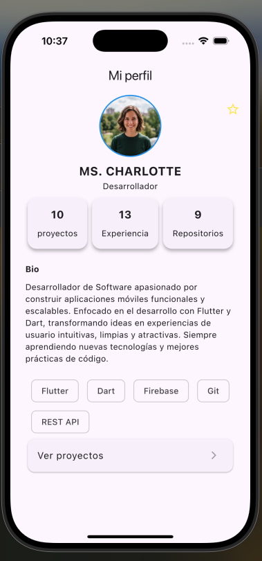
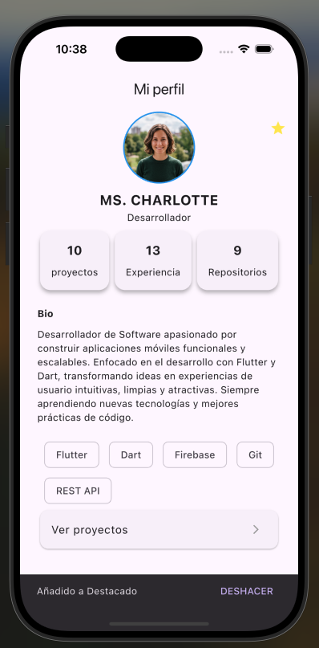
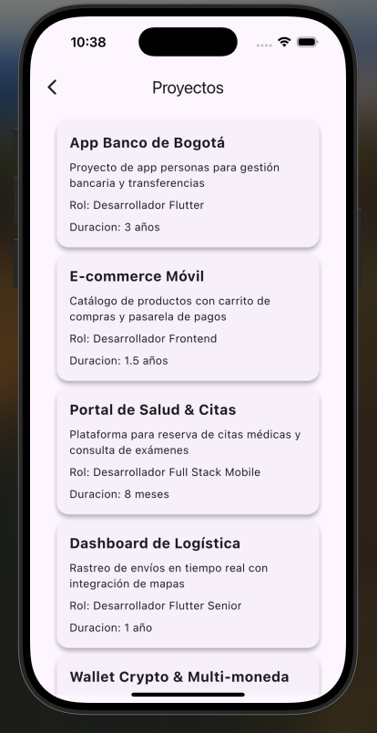

# mi_perfil_dev

Aplicación Flutter de perfil profesional para desarrolladores. Funciona como una tarjeta de presentación digital / CV interactivo que muestra información personal, estadísticas de carrera, habilidades tecnológicas y proyectos destacados.

---

## Capturas de pantalla

| Perfil | Perfil destacado | Proyectos |
|---|---|---|
|  |  |  |

---

## Funcionalidades

- **Foto de perfil interactiva**: al tocarla se abre un visor a pantalla completa con soporte de zoom (hasta 4×) y gestos de paneo.
- **Marcar como destacado**: botón de estrella que alterna el estado de favorito del perfil
- **Estadísticas de carrera**: tarjetas compactas con número de proyectos, años de experiencia y repositorios.
- **Sección bio**: descripción breve del perfil profesional.
- **Chips de tecnologías**: badges visuales con el stack de habilidades (Flutter, Dart, Firebase, Git, REST API).
- **Lista de proyectos**: navegación a una segunda pantalla con tarjetas detalladas de cada proyecto (nombre, descripción, rol y duración).

---

## Estructura del proyecto

```
lib/
├── main.dart                      # Punto de entrada y configuración del tema
├── data/
│   └── project_data.dart          # Datos estáticos de los proyectos del portafolio
├── models/
│   └── project_model.dart         # Modelo de datos para proyectos
├── screens/
│   ├── profile_screen.dart        # Pantalla principal del perfil
│   └── project_list_screen.dart   # Pantalla de lista de proyectos
└── widgets/
    ├── bio_info.dart              # Widget de sección de biografía
    ├── icon_button.dart           # Botón de icono con tooltip (favorito)
    ├── info_card.dart             # Tarjeta de estadística (número + etiqueta)
    ├── list_button.dart           # Botón de navegación a la lista de proyectos
    └── project_card.dart          # Tarjeta individual de proyecto

assets/
├── images/
│   └── profile.jpeg               # Foto de perfil
└── screenshots/
    ├── screenshot_1.png           # Pantalla de perfil
    ├── screenshot_2.png           # Pantalla de perfil destacado
    └── screenshot_3.png           # Pantalla de lista de proyectos
```

---

## Tecnologías

| Tecnología | Versión | Uso |
|---|---|---|
| Flutter | SDK | Framework UI multiplataforma |
| Dart | ^3.13.2 | Lenguaje de programación |
| Material Design 3 | - | Sistema de diseño y componentes UI |
| cupertino_icons | ^1.0.8 | Iconos estilo iOS |

No se utilizan paquetes externos de terceros. La app funciona únicamente con el SDK de Flutter y sus widgets nativos.

---

## Requisitos previos

- [Flutter SDK](https://docs.flutter.dev/get-started/install) `>=3.13.2`
- Dart `>=3.13.2`
- Android Studio / Xcode (para correr en emulador o dispositivo físico)

---

## Instalación y ejecución

```bash
# 1. Clonar el repositorio
git clone <url-del-repositorio>
cd mi_pefil_dev

# 2. Instalar dependencias
flutter pub get

# 3. Correr la aplicación
flutter run
```

Para correr en una plataforma específica:

```bash
flutter run -d android   # Android
flutter run -d ios       # iOS
flutter run -d chrome    # Web
```

---

## Arquitectura

El proyecto sigue una arquitectura **simple por capas orientada a UI**:

```
models/ → screens/ → widgets/
```

- **`models/`**: clases de datos planas (`ProjectModel`).
- **`screens/`**: pantallas que ensamblan widgets y definen la lógica de navegación.
- **`widgets/`**: componentes reutilizables sin conocimiento del contexto global.
- **Navegación**: imperativa estándar de Flutter con `Navigator.push` y `MaterialPageRoute`.
- **Estado**: todos los widgets son `StatelessWidget`. Los datos son estáticos.

---

## Licencia

Este proyecto es privado y fue desarrollado como reto de práctica Flutter.

---

## Repositorio

[github.com/slorduy/mi-perfil-dev](https://github.com/slorduy/mi-perfil-dev)
